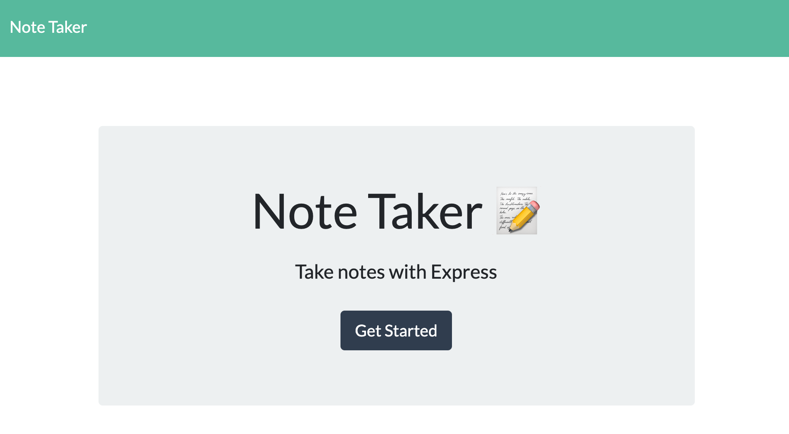

# note-taker

## Description

This project is a note taker application that can be used to write, save, and delete notes by retrieving data from a JSON file with the power of Express.  

## Table of Contents
- [Screenshot](#Screenshot)
- [Technology Used](#Technology%20Used)
- [License](#License)

## Screenshot

## Technology Used

* JavaScript
* Express
* Node

## License
[MIT](https://choosealicense.com/licenses/mit/#) License